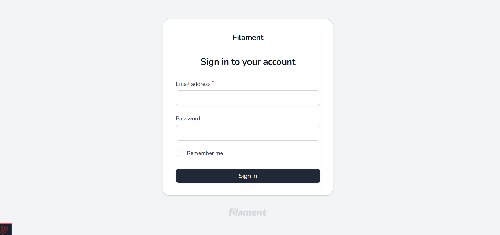
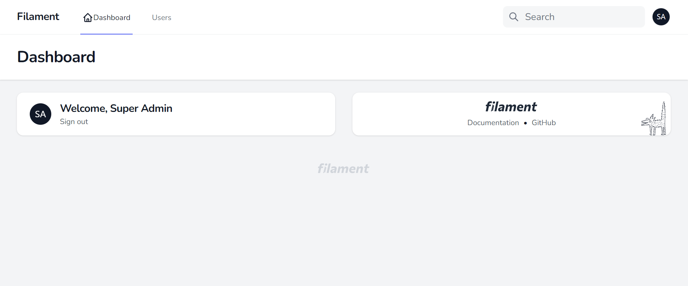
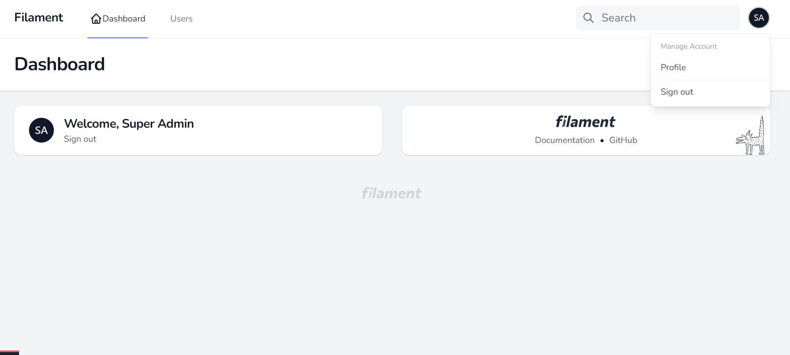
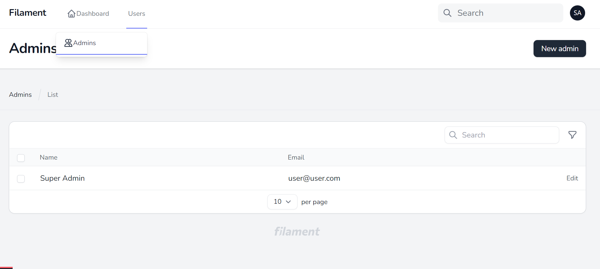
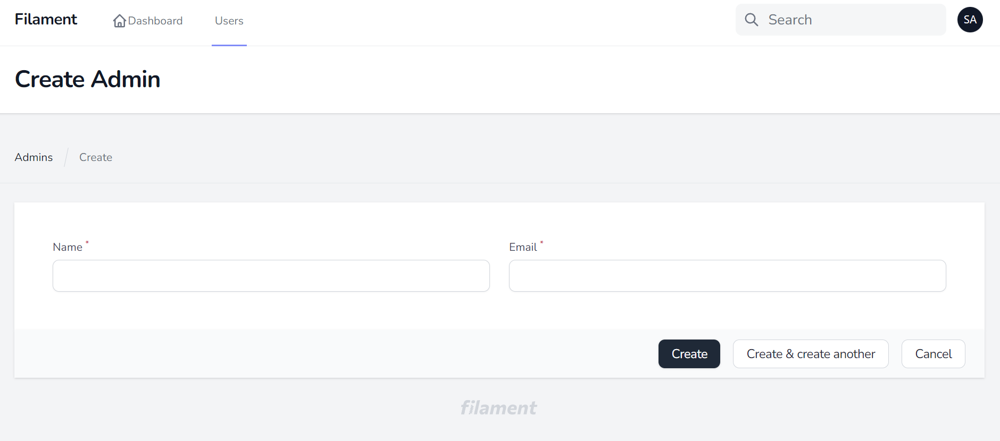

# Filament Jetstream Theme

A Jetstream theme for filament admin

## Installation

```bash
composer require webbingbrasil/filament-jetstream-theme
```

Optionally, you can publish the views using:

```bash
php artisan vendor:publish --tag="filament-jetstream-views"
```

## User manage account menu

To register new items to the user menu, you should use a service provider:

```php
use Filament\Facades\Filament;
use Filament\Navigation\UserMenuItem;
 
Filament::serving(function () {
    Filament::registerUserMenuItems([
        UserMenuItem::make()
            ->label('Settings')
            ->url(route('filament.pages.settings'))
            ->icon('heroicon-s-cog'),
        // ...
    ]);
});
```

## Add resource title and description

You can add title and description to resources pages using `$pageSectionTitle` and `$pageSectionDescription` properties in resource page class

```php
    <?php
    
    namespace App\Filament\Resources\UserResource\Pages;
    
    use App\Filament\Resources\UserResource;
    use Filament\Resources\Pages\CreateRecord;

    class CreateUserContent extends CreateRecord
    {
        protected static string $resource = UserResource::class;
    
        public string $pageSectionTitle = 'Resource Details';
        public string $pageSectionDescription = 'Resource details description';
    }
```

## Components

You can use a extra component to design you custom pages: `<x-filament-jetstream::grid-section>` 


Usage example
```
<x-filament-jetstream::grid-section>
        <x-slot name="title">
            title
        </x-slot>

        <x-slot name="description">
            description
        </x-slot>

        <x-filament::form wire:submit.prevent="create">
            <x-filament::card>
                {{ $this->form }}

                <x-slot name="footer">
                    <x-filament::form.actions :actions="$this->getFormActions()" />
                </x-slot>
            </x-filament::card>
        </x-filament::form>
    </x-filament-jetstream::grid-section>
```

## Screenshots








## Credits

-   [Danilo Andrade](https://github.com/dmandrade)

## License

The MIT License (MIT). Please see [License File](LICENSE.md) for more information.
